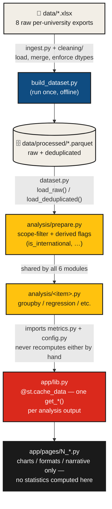

# 📊 Publication Intelligence & Research Impact Analysis Platform

**English** | [简体中文](README.zh-CN.md)

<p>
  
  
  
  
  
  
</p>

<p>
  <a href="https://data-platform.azurewebsites.net"></a>
  <a href="https://jamesxufan.github.io/research-impact-analysis-platform/"></a>
  <a href="https://jamesxufan.github.io/research-impact-analysis-platform/task-map.html"></a>
  <a href="https://jamesxufan.github.io/research-impact-analysis-platform/coverage-manual.html"></a>
  <a href="https://jamesxufan.github.io/research-impact-analysis-platform/data-pipeline.html"></a>
  <a href="https://jamesxufan.github.io/research-impact-analysis-platform/dashboard-charting.html"></a>
  <a href="https://jamesxufan.github.io/research-impact-analysis-platform/navigation.html"></a>
</p>

**COMP3888 Capstone · Team W11_02_P36**

An interactive analytical platform for exploring publication performance, research
impact, and collaboration patterns across the Go8 universities, built on
publication-level Scopus/SciVal bibliometric data. Six statistically-grounded
analyses, a Bauhaus-styled Streamlit interface, and a full bilingual documentation
set covering both the methodology and exactly which brief question each part
answers.

---

## Contents

- [Documentation](#documentation)
- [Overview](#overview)
- [At a glance](#at-a-glance)
- [The six analyses](#the-six-analyses)
- [Getting started](#getting-started)
- [Project structure](#project-structure)
- [Analysis pipeline](#analysis-pipeline)
- [Tech stack](#tech-stack)
- [Data & governance](#data--governance)
- [Deployment](#deployment)
- [Team](#team)

---

## Documentation

| Document | What it's for |
| --- | --- |
| [Task Map](https://jamesxufan.github.io/research-impact-analysis-platform/task-map.html) | Which files each of the 8 build tasks (6 analyses + layout + database) owns exclusively, which 4 files are shared by all of them, and the 5 direct task-to-task imports that don't route through the shared core — for splitting work without two people colliding on the same file |
| [Coverage Manual](https://jamesxufan.github.io/research-impact-analysis-platform/coverage-manual.html) | What the platform actually implements, and exactly which brief sub-question each part answers (✓/~/→/? per item), with a "why this chart" line under every one |
| [Data Pipeline Close-Reading](https://jamesxufan.github.io/research-impact-analysis-platform/data-pipeline.html) | Function-by-function walkthrough of `ingest.py` → `metrics.py` — for learning the pandas patterns this codebase leans on, not just citing a number |
| [Dashboard & Charting Close-Reading](https://jamesxufan.github.io/research-impact-analysis-platform/dashboard-charting.html) | Same treatment for `theme.py`'s section components and Altair's grammar of graphics — the radar chart's polar-coordinate trick worked in full |
| [Sub-Question Navigation Close-Reading](https://jamesxufan.github.io/research-impact-analysis-platform/navigation.html) | How a sub-question becomes a click-to-jump link — the same-page anchor jump and the `st.iframe`-based cross-page scroll bridge, taken apart in full with a traced worked example |
| [`docs/methodology.md`](docs/methodology.md) | The canonical, git-tracked metric definitions and PROVISIONAL flags — source of truth over the docs site above if they ever drift |
| [`data/dictionary/data_dictionary.md`](data/dictionary/data_dictionary.md) | Every raw and derived column, with data-quality notes |

> [!NOTE]
> The five docs above are static copies published from [`site/`](site/) via
> [GitHub Pages](https://jamesxufan.github.io/research-impact-analysis-platform/),
> rebuilt automatically by [`.github/workflows/pages.yml`](.github/workflows/pages.yml)
> on every push to `main` that touches `site/`. They started life as Claude
> Artifacts and may still be edited that way — see the artifact URLs in git
> history if you need to republish one — but the Pages copies in `site/` are
> what the badges above actually link to.

## Overview

This project develops an interactive analytical platform for exploring university
publication performance, research impact, and collaboration patterns using
publication-level bibliometric data. The platform supports data cleaning,
exploratory analysis, visualisation, and research-performance analysis — helping
identify publication trends, research strengths, collaboration patterns, and
potential improvement opportunities, with evidence-based insights to support
strategic research planning for the client, the University of Sydney.

**Design principles carried through every layer of this project:**

| Principle | In practice |
| --- | --- |
| 🎯 **One implementation per metric** | Every derived figure (Q1 share, FWCI mean, top-decile share, …) is computed in exactly one place (`src/p36/metrics/metrics.py`) and imported everywhere else — never recomputed by hand in an analysis module or a Streamlit page. |
| 📏 **Descriptive vs. tested, always labelled** | Five of the six analyses are descriptive statistics on the full (near-census) dataset; only the item 14 regression carries p-values and confidence intervals — and every page says which kind of claim it's making. |
| 🚧 **Provisional assumptions, named and flagged** | Every threshold or scope decision the client hasn't confirmed yet (Q1 cutoff basis, self-citation handling, open-access null-handling, …) is a named constant in `src/p36/config.py`, marked `PROVISIONAL`, never presented as settled. |

## At a glance

| | |
| --- | --- |
| **Universities covered** | 8 (Go8) — Adelaide, ANU, Monash, Sydney *(client)*, Melbourne, UNSW, UQ, UWA |
| **Publications, deduplicated** | 327,265 (from 385,664 raw per-university rows — 15.1% cross-university duplication) |
| **Analyses implemented** | 6 of the README's numbered items — 3, 6, 9, 14, 16, 17 |
| **Platform pages** | 6 Streamlit pages, Altair charts throughout, bilingual (EN/ZH) reference docs |
| **Regression model** | OLS, HC3-robust SE, field + document-type fixed effects, R² ≈ 0.019 |

## The six analyses

| # | Analysis | Core question | Module | Platform page |
| --- | --- | --- | --- | --- |
| 3 | Journal Tier & Q1 Analysis | What share of output sits in Q1 journals, and how does that vary — by tier, by field, by individual journal? | [`journal_tier.py`](src/p36/analysis/journal_tier.py) | [`2_Journal_Tier.py`](app/pages/2_Journal_Tier.py) |
| 6 | Research Field / Faculty Analysis | Which fields are strongest, improving, or under-performing? | [`field_analysis.py`](src/p36/analysis/field_analysis.py) | [`3_Field_Analysis.py`](app/pages/3_Field_Analysis.py) |
| 9 | International Collaboration Analysis | Are internationally co-authored papers cited more frequently — and does it hold within field and year? | [`international_collaboration.py`](src/p36/analysis/international_collaboration.py) | [`4_International_Collaboration.py`](app/pages/4_International_Collaboration.py) |
| 14 | Integrated Research Impact Driver Analysis | Holding the other factors constant, which of Q1 status, collaboration, open access, and document type actually associates with impact? | [`impact_drivers.py`](src/p36/analysis/impact_drivers.py) | [`5_Impact_Drivers.py`](app/pages/5_Impact_Drivers.py) |
| 16 | Go8 / Peer Benchmarking | How does Sydney perform relative to its Go8 peers, on volume, impact, Q1 share, and collaboration? | [`go8_benchmarking.py`](src/p36/analysis/go8_benchmarking.py) | [`1_Go8_Benchmarking.py`](app/pages/1_Go8_Benchmarking.py) |
| 17 | Scenario Analysis | What would mean impact look like under a hypothetical shift in Q1 share, collaboration, or open access? | [`scenario_analysis.py`](src/p36/analysis/scenario_analysis.py) | [`6_Scenario_Analysis.py`](app/pages/6_Scenario_Analysis.py) |

Every platform page opens with a **"Sub-questions this page answers"** panel —
a checklist mapping each chart back to the brief's actual bullet points,
including the ones not yet built (marked openly, not omitted).

## Getting started

> [!IMPORTANT]
> The raw QS/Scopus per-university exports (`data/*.xlsx`) and the processed
> dataset built from them (`data/processed/*.parquet`) are **not in this repo**
> — they're licensed data, excluded via `.gitignore` rather than pushed to git
> history (see [Data & governance](#data--governance)). Get the eight `.xlsx`
> files from the [group data folder](https://github.sydney.edu.au/xili0060/COMP3888_W11_02_P36/tree/main/data)
> and place them directly under `data/` before doing anything else — every
> step below depends on them.

```bash
pip install -r requirements.txt

# One-time: clean + dedupe the raw exports into data/processed/*.parquet.
# Re-run after the raw .xlsx files change; the app itself never reads the
# raw exports directly, only this processed output. Run from src/ — there's
# no pyproject.toml/setup.py yet, so `p36` is only importable with src/ as
# the working directory.
cd src
python -m p36.build_dataset
cd ..

# Launch the platform — http://localhost:8501
streamlit run app/Home.py
```

## Project structure

<details>
<summary><strong>Expand the full directory tree</strong></summary>

```
comp3888/
├── app/                      Streamlit platform
│   ├── Home.py                 landing page
│   ├── theme.py                 Bauhaus design system + Altair theme
│   ├── lib.py                   cached data/analysis access (single source of truth for the UI)
│   └── pages/                   one page per analysis item (1_Go8_Benchmarking.py … 6_Scenario_Analysis.py)
├── src/p36/                  analysis package
│   ├── config.py                every named threshold/scope constant — PROVISIONAL ones flagged
│   ├── ingest.py, cleaning/     raw-export loading, dtype safety, deduplication
│   ├── dataset.py, build_dataset.py   processed-parquet read/write
│   ├── metrics/                 canonical metric implementations — the single source every module imports
│   └── analysis/                one module per README analysis item
├── data/
│   ├── dictionary/               data_dictionary.md (tracked)
│   ├── *.xlsx                    raw per-university exports (git-ignored — see above)
│   └── processed/                 built parquet files (git-ignored — see above)
├── docs/                      methodology.md, meeting-notes/
├── .streamlit/config.toml     theme + toolbar config
└── requirements.txt
```

</details>

## Analysis pipeline

Every figure on every page passes through the same five layers, in the same
order — this is *why* the design principles above ("one implementation per
metric", cached wrappers only) work in practice, not just a rule on paper.



<details>
<summary><strong>Worked example — Go8 Benchmarking, "Sydney's rank on mean FWCI"</strong>
(<a href="app/pages/1_Go8_Benchmarking.py">1_Go8_Benchmarking.py</a>, lines 49–58)</summary>

1. [`dataset.load_raw()`](src/p36/dataset.py) reads `publications_raw.parquet`.
2. [`prepare.prepared_raw()`](src/p36/analysis/prepare.py) scope-filters it and adds `is_international`.
3. [`lib.load_raw()`](app/lib.py) caches steps 1–2 for the session.
4. [`go8_benchmarking.benchmark_summary()`](src/p36/analysis/go8_benchmarking.py) groups by
   `source_university`, calls `metrics.mean_fwci` per group, orders the result with
   `config.CLIENT_UNIVERSITY` first.
5. [`lib.get_benchmark_summary()`](app/lib.py) caches step 4.
6. The page calls `get_benchmark_summary()` once and reuses the same table for the rank
   card, the bar chart, and the radar chart — one fetch, three visualisations.

> [!TIP]
> **A cross-module dependency worth knowing:** `go8_benchmarking.institution_partner_flag()`
> is imported and called directly by `scenario_analysis.py` (not routed through `app/lib.py`)
> — see [scenario_analysis.py:129-131](src/p36/analysis/scenario_analysis.py#L129-L131). A
> signature or behaviour change to that function affects the Scenario Analysis page too, even
> though the two live in different analysis modules.

</details>

## Tech stack

| Layer | Tools |
| --- | --- |
| **Data** | pandas, pyarrow (parquet), openpyxl (reading the raw QS/Scopus exports) |
| **Statistics** | statsmodels (OLS, HC3 robust SE), scipy |
| **Platform** | Streamlit, Altair (Vega-Lite) — no Plotly, no JavaScript |
| **Deployment** | Local only — see [Getting started](#getting-started) |

## Data & governance

This project treats data provenance and metric consistency as first-class
concerns, not an afterthought:

- **Every threshold is a named constant**, not a magic number buried in an
  analysis module — see [`src/p36/config.py`](src/p36/config.py). Constants the
  client hasn't confirmed yet (the Q1 cutoff basis, self-citation handling,
  open-access null-handling, citation-window trimming, …) are explicitly
  marked `PROVISIONAL` and must carry that caveat wherever they appear in a
  finding.
- **The percentile direction was verified, not assumed** — Scopus/SciVal's
  convention is *lower percentile = better*, confirmed empirically against
  Field-Weighted Citation Impact before a single Q1 or highly-cited figure was
  computed (see `docs/methodology.md`).
- **Cross-field and cross-year comparisons always use a normalised metric**
  (FWCI or a SciVal percentile column), never raw citation counts, which
  differ 5–10× by citation culture alone.

> [!WARNING]
> **The raw `.xlsx` exports and the processed `.parquet` files are
> deliberately excluded from git history** (`.gitignore`) — this is licensed
> Scopus/QS bibliometric data at individual-publication granularity, not ours
> to redistribute via a public or semi-public git remote. Anyone working on
> this repo needs to obtain the raw exports separately (see
> [Getting started](#getting-started)) and rebuild the processed dataset
> locally.

## Deployment

This repo's own deploy step is **local only** — see [Getting started](#getting-started)
above; `streamlit run app/Home.py` is the entire thing. There is no CI/CD workflow in
this repository that deploys anywhere.

A live instance is separately hosted at
**[data-platform.azurewebsites.net](https://data-platform.azurewebsites.net)**,
updated by hand rather than by a tracked workflow — treat it as a convenience mirror,
not the source of truth; the repository and `docs/methodology.md` are that.

## Team

[Group Wiki](https://github.sydney.edu.au/xili0060/COMP3888_W11_02_P36/wiki/COMP3888_W11_02_P36-wiki) ·
[Data folder](https://github.sydney.edu.au/xili0060/COMP3888_W11_02_P36/tree/main/data)
