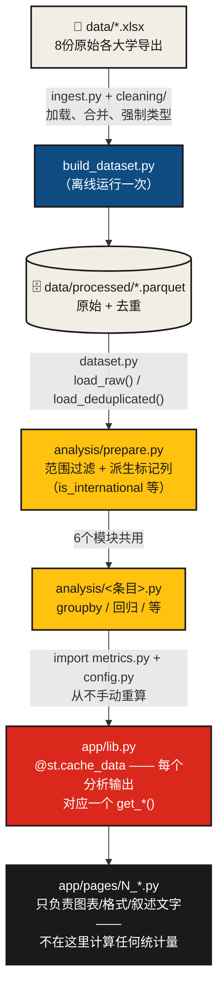

# 📊 学术研究影响力分析平台

[English](README.md) | **简体中文**

<p>
  
  
  
  
  
  
</p>

<p>
  <a href="https://data-platform.azurewebsites.net"></a>
  <a href="https://jamesxufan.github.io/research-impact-analysis-platform/"></a>
  <a href="https://jamesxufan.github.io/research-impact-analysis-platform/task-map.html"></a>
  <a href="https://jamesxufan.github.io/research-impact-analysis-platform/coverage-manual.html"></a>
  <a href="https://jamesxufan.github.io/research-impact-analysis-platform/data-pipeline.html"></a>
  <a href="https://jamesxufan.github.io/research-impact-analysis-platform/dashboard-charting.html"></a>
  <a href="https://jamesxufan.github.io/research-impact-analysis-platform/navigation.html"></a>
</p>

**COMP3888 毕业设计 · W11_02_P36 小组**

一个交互式分析平台，用于探索 Go8 八所大学在发表表现、研究影响力与合作模式上的
情况，基于发表级别的 Scopus/SciVal 文献计量数据构建。包含六项有统计学依据的分析、
一套包豪斯（Bauhaus）风格的 Streamlit 界面，以及一整套双语参考文档，既讲清楚方法论，
也讲清楚每一部分具体回答了任务书里的哪个问题。

> [!NOTE]
> 本文件是 [README.md](README.md) 的中文翻译，随英文版手动同步维护——如果两者出现
> 出入，以英文版为准。

---

## 目录

- [文档](#文档)
- [概览](#概览)
- [一览](#一览)
- [六项分析](#六项分析)
- [快速开始](#快速开始)
- [项目结构](#项目结构)
- [分析管道](#分析管道)
- [技术栈](#技术栈)
- [数据与治理](#数据与治理)
- [部署](#部署)
- [团队](#团队)

---

## 文档

| 文档 | 用途 |
| --- | --- |
| [任务地图](https://jamesxufan.github.io/research-impact-analysis-platform/task-map.html) | 8个建设任务（6个分析 + 排版 + 数据库）各自专属哪些文件、哪4个文件是所有任务共用的、以及不经过公共核心的5条任务间直接import关系——方便分工时不会两个人同时改一个文件 |
| [覆盖手册](https://jamesxufan.github.io/research-impact-analysis-platform/coverage-manual.html) | 平台到底实现了什么，以及每一部分具体回答了任务书里的哪一个子问题（每项标✓/~/→/?），每一条下面还有一行"为什么选这张图" |
| [数据管道精读](https://jamesxufan.github.io/research-impact-analysis-platform/data-pipeline.html) | 从 `ingest.py` 到 `metrics.py` 的逐函数讲解——用来学习这个代码库依赖的pandas写法，而不只是引用一个数字 |
| [看板与图表精读](https://jamesxufan.github.io/research-impact-analysis-platform/dashboard-charting.html) | 同样的处理方式用在 `theme.py` 的板块组件和Altair图形语法上——雷达图的极坐标技巧完整拆解 |
| [子问题跳转机制精读](https://jamesxufan.github.io/research-impact-analysis-platform/navigation.html) | 一个子问题是怎么变成一个可点击跳转链接的——同页锚点跳转，以及基于 `st.iframe` 的跨页跳转桥，配一个完整追踪的实例 |
| [`docs/methodology.md`](docs/methodology.md) | 权威的、git追踪的指标定义与PROVISIONAL标记——如果和上面的文档站有出入，以这份为准 |
| [`data/dictionary/data_dictionary.md`](data/dictionary/data_dictionary.md) | 每一列原始/派生字段的说明，附数据质量注记 |

> [!NOTE]
> 上面五份文档是从 [`site/`](site/) 通过 [GitHub Pages](https://jamesxufan.github.io/research-impact-analysis-platform/)
> 发布的静态副本，由 [`.github/workflows/pages.yml`](.github/workflows/pages.yml)
> 在每次 `main` 分支涉及 `site/` 的push时自动重新构建。它们最初是Claude Artifact，
> 现在仍然可以那样编辑——需要重新发布时看git历史里的artifact链接——但徽章实际链接到的，
> 是 `site/` 里的Pages副本。

## 概览

本项目开发了一个交互式分析平台，用发表级别的文献计量数据探索大学发表表现、研究
影响力与合作模式。平台支持数据清洗、探索性分析、可视化和研究表现分析——帮助识别
发表趋势、研究优势、合作模式与潜在的提升空间，为客户悉尼大学的战略研究规划提供
有数据支撑的洞察。

**贯穿项目每一层的设计原则：**

| 原则 | 具体做法 |
| --- | --- |
| 🎯 **每个指标只有一处实现** | 每个派生数字（Q1份额、平均FWCI、高被引占比……）只在一个地方计算（`src/p36/metrics/metrics.py`），其它地方全部import它——绝不在某个分析模块或Streamlit页面里手动重算 |
| 📏 **描述性 vs. 检验性，全部标清楚** | 六项分析里有五项是对完整（近乎普查）数据集的描述性统计；只有第14项的回归带p值和置信区间——每个页面都会说明自己给出的是哪一种论断 |
| 🚧 **暂定假设，全部命名并标记** | 每一个客户还没确认的阈值或范围决定（Q1的判定口径、是否排除自引、开放获取的空值处理……）都是 `src/p36/config.py` 里一个有名字的常量，标记为 `PROVISIONAL`，绝不当成已敲定的事实呈现 |

## 一览

| | |
| --- | --- |
| **覆盖的大学** | 8所（Go8）——阿德莱德、澳国立、莫纳什、悉尼*（客户）*、墨尔本、新南威尔士、昆士兰、西澳 |
| **去重后的发表数** | 327,265篇（原始385,664条按大学分的行——15.1%是跨校重复） |
| **已实现的分析** | README编号条目中的6项——3、6、9、14、16、17 |
| **平台页面** | 6个Streamlit页面，全程Altair图表，双语（中英）参考文档 |
| **回归模型** | OLS，HC3稳健标准误，学科+文献类型固定效应，R² ≈ 0.019 |

## 六项分析

| # | 分析 | 核心问题 | 模块 | 平台页面 |
| --- | --- | --- | --- | --- |
| 3 | 期刊等级与Q1分析 | 多少产出落在Q1期刊里，这个比例又是怎么变化的——按档位、按学科、按具体期刊？ | [`journal_tier.py`](src/p36/analysis/journal_tier.py) | [`2_Journal_Tier.py`](app/pages/2_Journal_Tier.py) |
| 6 | 研究学科/院系分析 | 哪些学科最强、在进步、或表现不足？ | [`field_analysis.py`](src/p36/analysis/field_analysis.py) | [`3_Field_Analysis.py`](app/pages/3_Field_Analysis.py) |
| 9 | 国际合作分析 | 国际合著的论文是否被引用得更多——在控制学科和年份之后依然成立吗？ | [`international_collaboration.py`](src/p36/analysis/international_collaboration.py) | [`4_International_Collaboration.py`](app/pages/4_International_Collaboration.py) |
| 14 | 综合研究影响力驱动因素分析 | 在控制其它因素不变的情况下，Q1身份、合作、开放获取、文献类型里，到底哪些真正跟影响力相关？ | [`impact_drivers.py`](src/p36/analysis/impact_drivers.py) | [`5_Impact_Drivers.py`](app/pages/5_Impact_Drivers.py) |
| 16 | Go8同行对标 | 悉尼相对于Go8同行在发文量、影响力、Q1份额和合作方面表现如何？ | [`go8_benchmarking.py`](src/p36/analysis/go8_benchmarking.py) | [`1_Go8_Benchmarking.py`](app/pages/1_Go8_Benchmarking.py) |
| 17 | 情景分析 | 如果Q1份额、合作程度或开放获取发生假设性变化，平均影响力会变成什么样？ | [`scenario_analysis.py`](src/p36/analysis/scenario_analysis.py) | [`6_Scenario_Analysis.py`](app/pages/6_Scenario_Analysis.py) |

每个平台页面开头都有一个**"本页回答的子问题"**面板——一份清单，把每张图表对应回
任务书里实际的条目，包括那些还没做出来的（是明确标出来的，不是悄悄略过）。

## 快速开始

> [!IMPORTANT]
> 原始的QS/Scopus各大学导出文件（`data/*.xlsx`）以及基于它们构建的处理后数据集
> （`data/processed/*.parquet`）**不在本仓库里**——它们是有版权的数据，通过
> `.gitignore` 排除，从未进入git历史（见[数据与治理](#数据与治理)）。请先从
> [小组数据文件夹](https://github.sydney.edu.au/xili0060/COMP3888_W11_02_P36/tree/main/data)
> 拿到这8个 `.xlsx` 文件，直接放进 `data/` 目录下，再做其它任何事——下面每一步
> 都依赖这些文件。

```bash
pip install -r requirements.txt

# 一次性操作：把原始导出清洗、去重，构建成 data/processed/*.parquet。
# 原始.xlsx文件变化后需要重新跑一次；应用本身从不直接读原始导出，
# 只读这份处理后的输出。要从 src/ 目录下运行——目前还没有
# pyproject.toml/setup.py，所以 `p36` 只有在 src/ 是工作目录时才能被import。
cd src
python -m p36.build_dataset
cd ..

# 启动平台 —— http://localhost:8501
streamlit run app/Home.py
```

## 项目结构

<details>
<summary><strong>展开完整目录树</strong></summary>

```
comp3888/
├── app/                      Streamlit 平台
│   ├── Home.py                 首页
│   ├── theme.py                 包豪斯设计系统 + Altair主题
│   ├── lib.py                   带缓存的数据/分析访问层（UI唯一的数据来源）
│   └── pages/                   每个分析条目一个页面（1_Go8_Benchmarking.py … 6_Scenario_Analysis.py）
├── src/p36/                  分析包
│   ├── config.py                每一个有名字的阈值/范围常量——PROVISIONAL的会标出来
│   ├── ingest.py, cleaning/     原始导出加载、类型安全、去重
│   ├── dataset.py, build_dataset.py   处理后parquet的读写
│   ├── metrics/                 指标的权威实现——所有模块都import这里
│   └── analysis/                每个README分析条目一个模块
├── data/
│   ├── dictionary/               data_dictionary.md（已追踪）
│   ├── *.xlsx                    原始各大学导出（git已忽略——见上）
│   └── processed/                 构建出的parquet文件（git已忽略——见上）
├── docs/                      methodology.md、meeting-notes/
├── .streamlit/config.toml     主题+工具栏配置
└── requirements.txt
```

</details>

## 分析管道

每个页面上的每个数字都经过同样的五层、同样的顺序——这正是上面那些设计原则
（"每个指标只有一处实现"、只用带缓存的包装函数）在实践中真正成立的原因，而不
只是纸面上的规定。



<details>
<summary><strong>实例演示 —— Go8 Benchmarking，"悉尼在平均FWCI上的排名"</strong>
（<a href="app/pages/1_Go8_Benchmarking.py">1_Go8_Benchmarking.py</a>，第49–58行）</summary>

1. [`dataset.load_raw()`](src/p36/dataset.py) 读取 `publications_raw.parquet`。
2. [`prepare.prepared_raw()`](src/p36/analysis/prepare.py) 对它做范围过滤，加上 `is_international`。
3. [`lib.load_raw()`](app/lib.py) 把第1-2步的结果在本次会话里缓存住。
4. [`go8_benchmarking.benchmark_summary()`](src/p36/analysis/go8_benchmarking.py) 按
   `source_university` 分组，对每组调用 `metrics.mean_fwci`，把 `config.CLIENT_UNIVERSITY`
   排在结果最前面。
5. [`lib.get_benchmark_summary()`](app/lib.py) 缓存第4步的结果。
6. 页面只调用一次 `get_benchmark_summary()`，同一张表被排名卡片、柱状图、雷达图三处
   复用——取一次数，出三个可视化。

> [!TIP]
> **一个值得知道的跨模块依赖：** `go8_benchmarking.institution_partner_flag()`
> 被 `scenario_analysis.py` 直接import并调用（没有经过 `app/lib.py`）——见
> [scenario_analysis.py:129-131](src/p36/analysis/scenario_analysis.py#L129-L131)。
> 改动这个函数的签名或行为，也会影响Scenario Analysis页面，尽管两者属于不同的
> analysis模块。

</details>

## 技术栈

| 层 | 工具 |
| --- | --- |
| **数据** | pandas、pyarrow（parquet）、openpyxl（读取原始QS/Scopus导出） |
| **统计** | statsmodels（OLS，HC3稳健标准误）、scipy |
| **平台** | Streamlit、Altair（Vega-Lite）——不用Plotly，不写JavaScript |
| **部署** | 仅本地——见[快速开始](#快速开始) |

## 数据与治理

本项目把数据溯源和指标一致性当作头等重要的事，而不是事后补充：

- **每个阈值都是一个有名字的常量**，不是埋在某个分析模块里的魔法数字——见
  [`src/p36/config.py`](src/p36/config.py)。客户还没确认的常量（Q1判定口径、
  是否排除自引、开放获取的空值处理、引用窗口截断……）都明确标记为 `PROVISIONAL`，
  出现在任何结论里都必须带上这个说明。
- **百分位的方向是经过验证的，不是假设出来的**——Scopus/SciVal的约定是
  *百分位越小越好*，在算出第一个Q1或高被引数字之前，就已经用Field-Weighted
  Citation Impact做了实证核实（见 `docs/methodology.md`）。
- **跨学科和跨年份的比较，永远用归一化后的指标**（FWCI或SciVal百分位列），
  绝不用原始引用数——光是引用文化差异就能造成5–10倍的差距。

> [!WARNING]
> **原始 `.xlsx` 导出文件和处理后的 `.parquet` 文件被有意排除在git历史之外**
> （`.gitignore`）——这是有版权的Scopus/QS单篇文献粒度的文献计量数据，我们
> 没有权利通过公开或半公开的git远程仓库再分发。任何要参与本仓库开发的人，
> 都需要单独获取原始导出文件（见[快速开始](#快速开始)），并在本地重新构建
> 处理后的数据集。

## 部署

本仓库自己的部署步骤**仅限本地**——见上面的[快速开始](#快速开始)；
`streamlit run app/Home.py` 就是全部的部署步骤。仓库里没有任何会把它部署到
别处的CI/CD工作流。

另外单独维护了一份线上实例，托管在
**[data-platform.azurewebsites.net](https://data-platform.azurewebsites.net)**，
是手动更新的，不是由被追踪的工作流自动部署——把它当作一个方便访问的镜像，
不是权威来源；仓库本身和 `docs/methodology.md` 才是。

## 团队

[小组Wiki](https://github.sydney.edu.au/xili0060/COMP3888_W11_02_P36/wiki/COMP3888_W11_02_P36-wiki) ·
[数据文件夹](https://github.sydney.edu.au/xili0060/COMP3888_W11_02_P36/tree/main/data)
